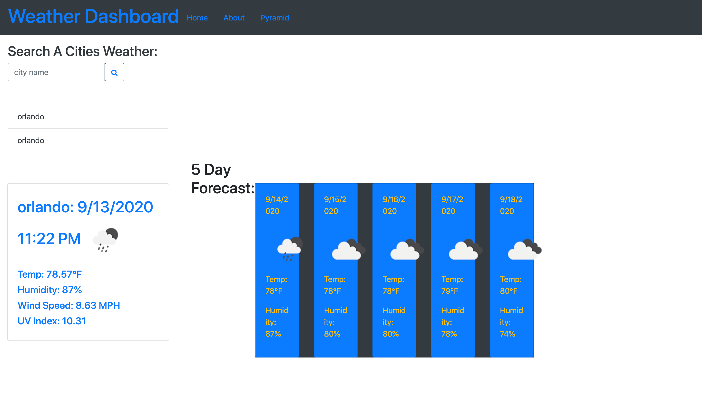

# **Weather-Dashboard**
## Description
---
### Weather-dashboard is a site that provides server-side api to find the weather in different cities.

## Tools 
>1. HTML
>2. CSS
>3. JAVASCRIPT
>4. BOOTSTRAP
>5. JQUERY
>6. MOMENT.JS

[WEATHER-DASHBOARD](https://mcowley1.github.io/weather-dashboard/)
